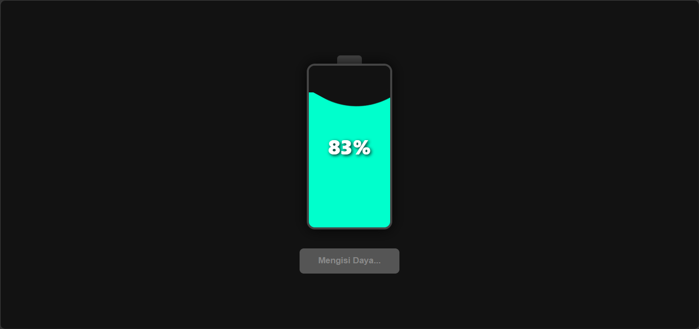

# 🔋 Animasi Pengisian Baterai

Animasi baterai interaktif yang dibuat menggunakan HTML, CSS, dan JavaScript. Proyek ini menampilkan efek pengisian daya dengan gelombang cairan (wave animation), perubahan warna berdasarkan persentase baterai, serta animasi pengisian yang halus dan menarik.

## 📸 Preview



## ✨ Fitur

* Animasi pengisian baterai interaktif
* Efek gelombang cairan (wave effect)
* Persentase baterai real-time
* Perubahan warna sesuai level baterai
* Efek glow modern
* Desain minimalis dan responsif
* Dibuat menggunakan HTML, CSS, dan JavaScript murni

## 🛠️ Teknologi yang Digunakan

* HTML5
* CSS3
* JavaScript

## 🚀 Cara Menjalankan

1. Download atau clone repository ini.
2. Buka file `index.html` menggunakan browser.
3. Klik tombol **Cas Sekarang** untuk memulai animasi pengisian daya.

## 📂 Struktur Proyek

```text
├── index.html
├── preview.png
└── README.md
```

## 📄 Lisensi

Proyek ini bebas digunakan untuk keperluan belajar, pengembangan, dan referensi pribadi.
